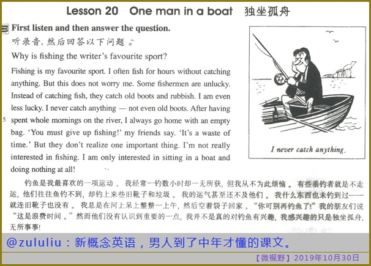
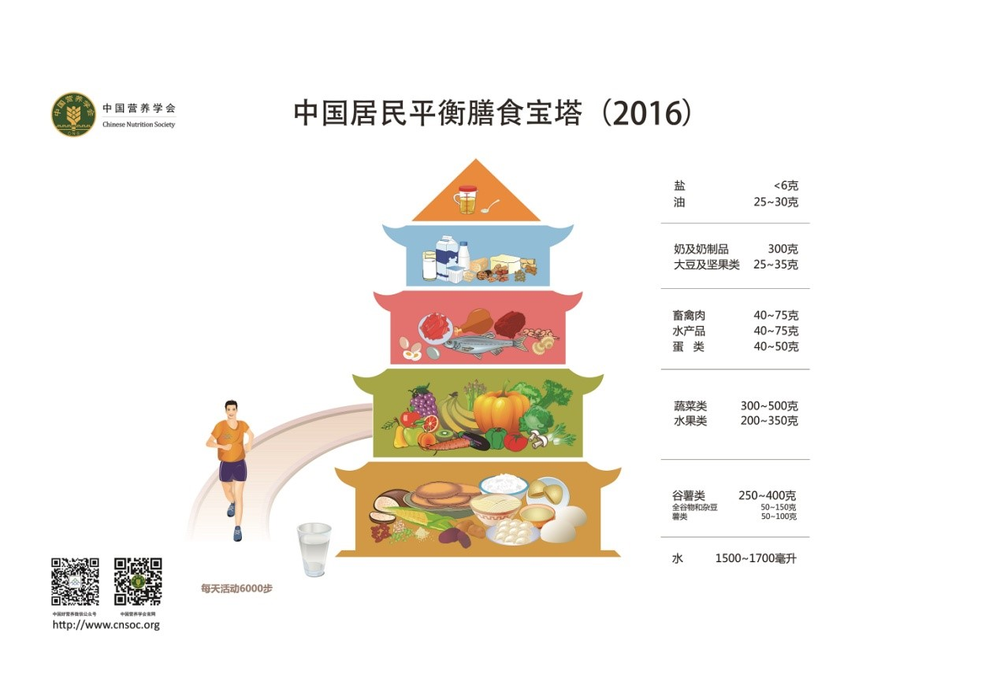
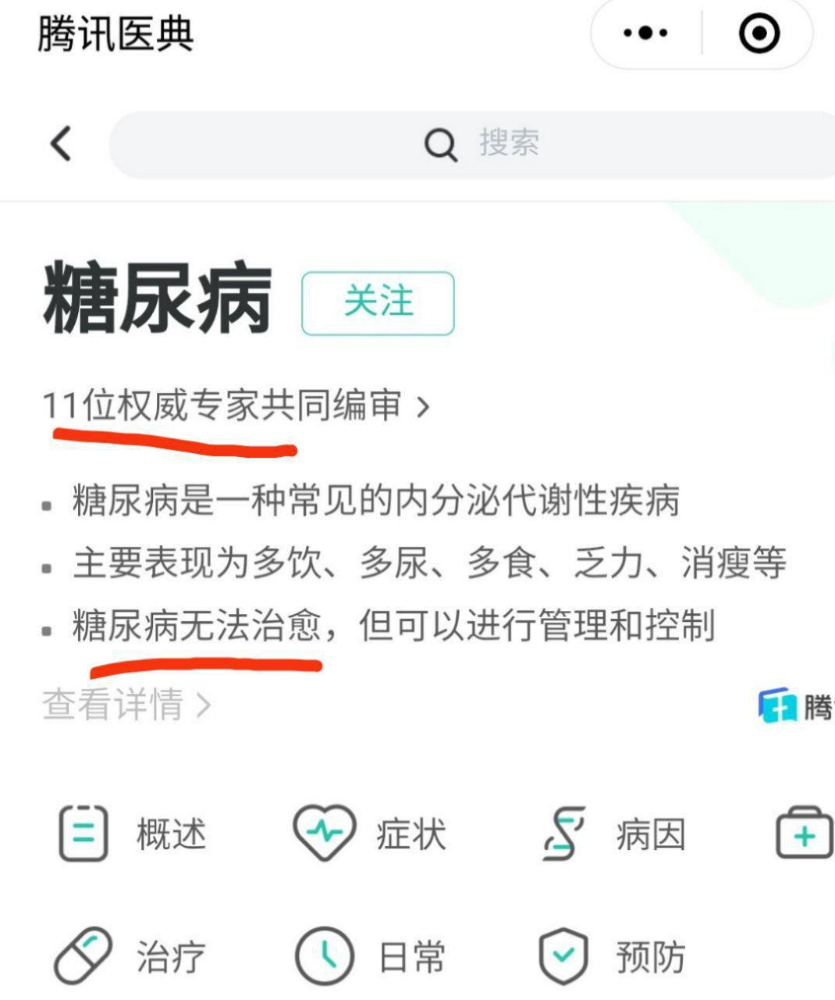
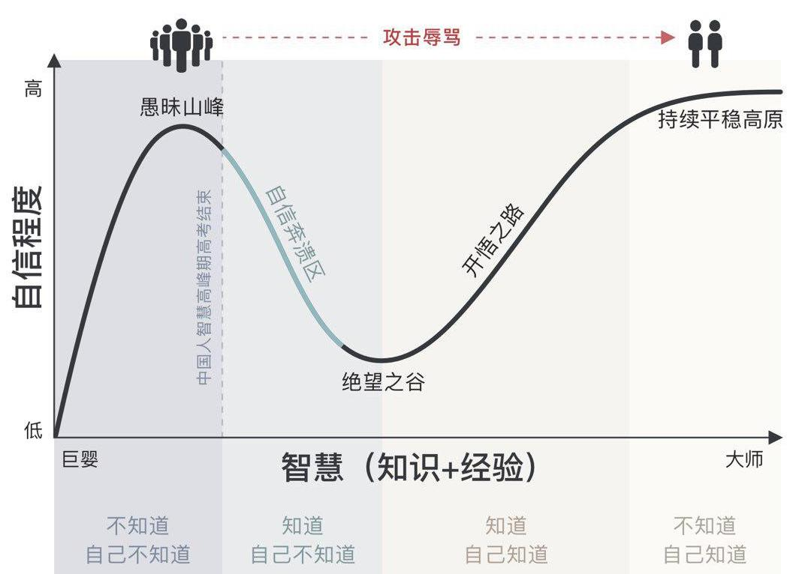

# 把你的英语用起来

如果做一件事情对你来说很痛苦，很无聊，不管那是什么事情，你一定不会做好。这十有八九不是你自己的问题，而更可能是亿万年来自然选择的结果，我们的基因并不认同“愚公移山”的精神。

其实早在高中，我就开始怀疑学校教英语的方法了！我们不停的换教材，背无聊的课文、单词或短语，但是有什么用呢？一年半载下来我都不知道学到了什么，对书上讲的一点印象也没有。当时听了不少关于学英语的演讲，听了几次关于背`新概念英语`的传说，于是我打算把新概念后两册给背下来，两年下来我把第三册背了40来篇(有些我实在没兴趣)，第四册背了可能有十多篇，高考英语大概125分吧(当年英语老师布置的很多作业我基本都不做)。

高中有一个好朋友，不求甚解，每次我想不明白一件事情时，他就会说记住结论就行了。这并不是我想要的，我不想只是考个好成绩，我想搞清楚背后的原理，当时我认为这比好成绩要重要的多。**当时感觉好像只有我一个人不正常，现在看了Paul Graham的文章，听了乔布斯的演讲，感觉我很正常。**

引用`伍君仪`的《把你的英语用起来》中的一段话：

>**误区六：学英文背诵短文很有用**

>常见这个例子，某某人背诵了120篇新概念文章，写作文把美国教授都感动哭了。先不说这个例子是假的吧，我们就说所谓的有效是什么意思：一样是开垦荒地，我用拖拉机半天搞定，你老牛拖破车，几周才搞定，然后你欢欣鼓舞，到处宣扬自己的成功，让大家都去用破车耕地，却放弃免费的拖拉机不用。

>英文学习，任何方法其实都是有效的，只要坚持做。评价一个方法好还是不好，无非是看效率、普及性以及成功率。有了工作的人不可能像学生时代那么心无旁骛地死读书，这种自我毁灭式的方法根本不值得推广。学习本来应该是充满乐趣的，如此枯燥，一般人坚持不了。如果有一种疗法或者药品，临床实验证明失败率超过50%，我相信CFDA（国家食品药品监督管理总局）是不可能让它顺利上市的。通过背诵，学习的失败率我没做过科学统计，仅仅从身边来看，远远超过50%，可是仍然有很多人过分强调这种明显违背了语言学规律的方法，本身态度就很不科学。其实我们不应该过分强调所谓的坚持和毅力，而应该找到更容易坚持下去、对毅力的耗损没那么大的办法。

按照这本书的观点，我可能算走了一些弯路，但现在发现也不算白走，就像Steve Jobs演讲中关于`connecting the dots`，有些事你当时可能感觉没啥用，等你将来需要时，过去所学基本都会发挥作用。

 - 当时我就像背语文课文一样背下来一些，但现在再去重读`Bertrand Russell`的`How to Grow Old`，或者`George Orwell`的`The Sporting Spirit`，会感觉非常有道理，直到现在大多数人依然不明白！

 - 还有前一段时间看到`Hacker News`上一个讨论[College-educated workers are taking over the American factory floor](https://news.ycombinator.com/item?id=21745704)，有人认为美国大学教育是除健康产业外最大的一种资源误配，这让我想起了新概念英语3中一篇`The Double Life of Alfred Bloggs`，文中讲有很多人蓝领比白领赚钱多，但是白领看着更加体面，这就引发了很多奇怪的现象！`Alfred Bloggs`做着蓝领的工作，但每天穿西装出门，几年来他妻子都不知道真相……这让我了解到，原来早在几十年前，美国大学生可能就已经过剩了。

 - 前一段时间看了一个视频[北京深夜的漆黑角落，是中年男人仅剩的一点乐趣](https://youtu.be/6h1gF-vowM8)，让我了解到中年人的不易，不禁又想起新概念3上的一篇文章，原来现在很多事情，跟过去相比并没有什么变化。

我讲这些并不是让你去学新概念英语，而是说你前期走过的所有弯路其实都是有价值的，看看Paul Graham的关于创业的散文，你会学到很多东西。

---

刚进大学时，我对学英语的方向又有点迷茫了，我不知道学英语到底有什么用，我发现专业英语需要的词汇并不是特别多，我对学英语也没有特别高的追求，只不过看看英文电子书和文档，看看美剧和电影而已。有一阵子我甚至学了点俄语，看了一些俄剧和俄罗斯电影，俄罗斯黑客很厉害，我很希望能够跟他们学到一点东西。我在v2ex的用户名`ytpfxnj`在俄语键盘中是`не за что`，意思是`不客气`。

大学时学校教的太多东西很没用，落后时代几十年，我实在难以想象为啥大家都要花钱忍受这些东西，还不如自己从网上学呢！**当时感觉好像只有我一个人不正常，现在看了Paul Graham的文章，听了乔布斯的演讲，感觉我很正常。**

等我工作之后，偶尔会帮公司翻译些文档，看些原版技术书，直到2018年11月偶然统计了一下`A Song of Ice and Fire`和`New Concept English`的[词汇量](https://github.com/evmn/word_frenquency)，发现新概念4总共才4710词，其中2721个只出现了一次，那我的词汇量可能还不到4000呢！当时冰与火之歌最终季还有几个月就要开播了，而我看电视剧虽然很爽，但很多地方都搞不明白，打算在开播前把这套书过一遍。了解到这套书的中文译者四级都没过，而我六级都轻松过了，这让我更加有信心去看这套原版书了。

冬季我在公司比较闲，先硬着头皮看了两章(已经忘记是第几次尝试这套书了)，之后越看越来劲，11月份用`DPT-RP1`(我并不太推荐这个阅读器，贵并且速度慢，破解后也不宜看大文件)把`A Game of Thrones`和`A Clash of Kings`给看完了，但是后来忘记索尼阅读器出现啥bug了，换用`Kindle`看第三本`A Storm of Swords`，由于这本书比较长，`Kindle`屏幕太小，这本书大概用了两个月才看完。第四本等春节过后才开始看，又换上了`DPT-RP1`，期间也做了看雪CTF花了一些时间，直到2019年4月1号才看完。最后一本书看着看着电视剧就开播了，但是因为电视剧中的内容书上并没有，书上一些内容电视剧中也没讲，所以我就接着给看完了，结束日期是2019年5月4日。这是我有生以来看过的最长的书，完成之后我对自己更加有信心了。

在此之前看过尤瓦尔·赫拉利的几本英文原著，以及比尔盖茨推荐的一些英文书，但好像没看过小说。

---

2018年有段时间我在看《天生就会跑》，上面的一些观点颠覆了我的三观，之后我在网上看到跑酷教练高科(`城市就是健身房`的作者)在一个视频中提到`鞋于脚无大用`，我把发现放到v2ex上[跑鞋是商业骗局吗](https://v2ex.com/t/480600)，赢得一些网友的冷嘲热讽(当然也有不少网友默默支持，非常感谢你们)，这让我更加有动力去查找资料，证明我的观点。可能只有你跟身边人的三观差异巨大，你才更有动力去寻找更加权威的英文资料来支撑自己的观点。

前一阵子看了Tinyfool老师的一篇文章，对糖尿病有点兴趣，看了`The Diabetes Code`，才了解到原来过量摄入碳水化合物可以才是糖尿病的真凶，间歇性禁食才是正确的饮食习惯，原来膳食金字塔早已过时(而中国还在用)，原来2型糖尿病可以逆转(中国权威却说没法治)，到现在难道你还没有学英语的动力吗？中文圈很难容得异议，很难跟得上社会的进步，而现在社会发展这么快，落后太多很可能被淘汰！

---

我学英语的过程大概就是这样的，有可能会遗漏一些现在感觉不那么重要的信息。俗话说`酒逢知己千杯少，话不投机半句多`，在国内想要找到知己是很难的，我人生有过多次选择几乎没一个人支持我，就靠国外名人的几句话坚持了下来，如果没有互联网，我可能就彻底抑郁了。

罗素讲：`In all affairs it's a healthy thing now and then to hang a question mark on the things you have long taken for granted`。时不时的质疑一下你认为理所当然的事情，是有益的。

## 参考链接

 - Paul Graham: [What You'll Wish You'd Known](paulgraham.com/hs.html)
 - Paul Graham: [The Lesson to Unlearn](http://paulgraham.com/lesson.html)
 - Hacker News: [College-educated workers are taking over the American factory floor](https://news.ycombinator.com/item?id=21745704)
 - Youtube: [北京深夜的漆黑角落，是中年男人仅剩的一点乐趣](https://youtu.be/6h1gF-vowM8)
 - evmn@github: [冰与火之歌和新概念英语的词汇量](https://github.com/evmn/word_frenquency)
 - v2ex: [跑鞋是商业骗局吗](https://v2ex.com/t/480600)
  - 中国营养学会： [专家解读|新版膳食指南（五）少盐少油，控糖限酒](http://dg.cnsoc.org/article/04/8a2389fd575f695101577a31ca7602d5.html)
